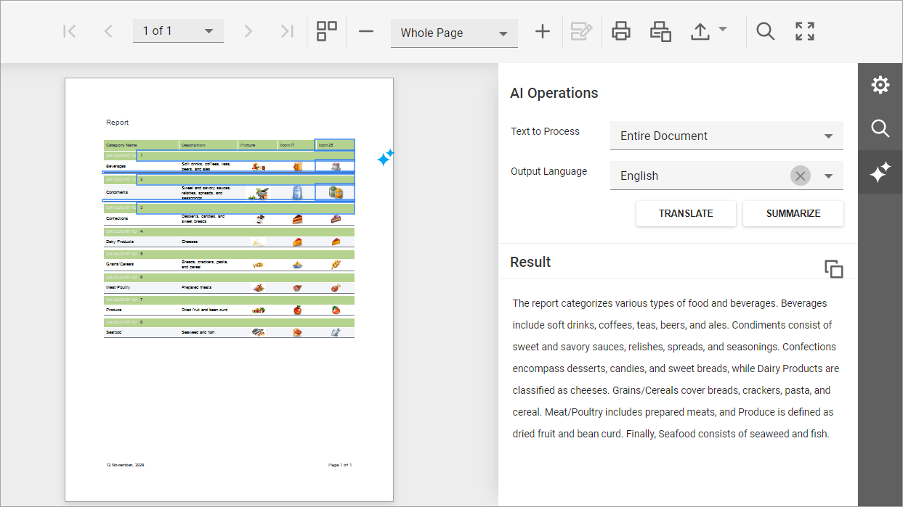

<!-- default badges list -->

[](https://supportcenter.devexpress.com/ticket/details/T1264540)
[](https://docs.devexpress.com/GeneralInformation/403183)
[](#does-this-example-address-your-development-requirementsobjectives)
<!-- default badges end -->
# Reporting for ASP.NET Core -  Summarize and Translate DevExpress Reports Using Azure OpenAI

This example adds AI-powered summarize/translate capabilities to the DevExpress JavaScript-based Document Viewer. These enterprise-ready features are available within the user interface via two buttons designed to access the document and process report content as follows: 

- **Summarize**: Uses generative AI to summarize report content and displays core insights associated with this report. 
- **Translate**: Uses AI services to translate report content to a different language. 

These actions are also available in context menu when you select report content. Note the AI Operations icon that floats next to the report page. Users can click it to invoke the context menu.

The following is an image of the application interface. As you can see, users can process the entire document, individual pages, or selected content. 



## Implementation Details

### Add NuGet Packages

Add the following NuGet packages:

- `DevExpress.AIIntegration.Blazor.Reporting.Viewer`
- `DevExpress.Drawing.Skia` (if you use a non-Windows environment)
- `Microsoft.Extensions.AI.OpenAI`, `Azure.AI.OpenAI`, `Azure.Identity` or `Microsoft.Extensions.AI.Ollama` based on your AI service preferences. This project uses Azure OpenAI. The remainder of this document describes steps related to this package.

> [!IMPORTANT]
> In v24.2.6+, we use version **9.3.0-preview.1.25161.3** of the _Microsoft.Extensions.AI.*_ libraries in our source code. We do not guarantee compatibility or correct operation with higher versions.

For the list of supported AI services and the corresponding prerequisites, refer to *Supported AI Services* in the following help topic: [AI-powered Extensions for DevExpress Reporting](https://docs.devexpress.com/XtraReports/405211/ai-powered-functionality/ai-for-devexpress-reporting#supported-ai-services
). 

### Add Personal Keys

> [!NOTE]  
> DevExpress AI-powered extensions follow the "bring your own key" principle. DevExpress does not offer a REST API and does not ship any built-in LLMs/SLMs. You need an active Azure/Open AI subscription to obtain the REST API endpoint, key, and model deployment name. These variables must be specified at application startup to register AI clients and enable DevExpress AI-powered Extensions in your application.

To use AI-based Summarize and Translate functionality in your application, you must create an Azure OpenAI resource in the Azure portal. Refer to the following help topic for additional information/guidance: [Microsoft - Create and deploy an Azure OpenAI Service resource](https://learn.microsoft.com/en-us/azure/ai-services/openai/how-to/create-resource?pivots=web-portal).

Once you obtain a private endpoint and an API key, open [appsettings.json](./CS/JSDocumentViewer/appsettings.json) and specify appropriate `DeploymentName`, `AzureOpenAIKey`, and `AzureOpenAIEndpoint` values. Note that `DeploymentName` is set to `GPT4o`, but you can specify a different model: 

```json
"AISettings": {
    "DeploymentName": "GPT4o",
    "AzureOpenAIKey": "",
    "AzureOpenAIEndpoint": ""
}
``` 

Create a class to read these settings:

```cs
public class AISettings {
    public string DeploymentName { get; set; }
    public string AzureOpenAIKey { get; set; }
    public string AzureOpenAIEndpoint { get; set; }
}
```

### Register AI Services on the Server

Call the `AddDevExpressAI` method at the application startup to register AI services in your application:

```cs
using DevExpress.AIIntegration;
using DevExpress.AIIntegration.Reporting;
using DevExpress.AIIntegration.Blazor.Reporting.Viewer.Models;
using Azure.AI.OpenAI;
using Azure;
using Microsoft.Extensions.AI;
// ...
var builder = WebApplication.CreateBuilder(args);

var settings = builder.Configuration.GetSection("AISettings").Get<AISettings>();
//To use Ollama
//IChatClient client = new OllamaChatClient(new Uri("http://localhost:11434/api/chat", "phi3.5:latest"));

IChatClient chatClient = new AzureOpenAIClient(
    new Uri(settings.AzureOpenAIEndpoint),
    new System.ClientModel.ApiKeyCredential(settings.AzureOpenAIKey)).AsChatClient(settings.DeploymentName);

builder.Services..AddSingleton(chatClient);
builder.Services.AddDevExpressAI((config) => {
    config.AddWebReportingAIIntegration(cfg =>
        cfg.SummarizationMode = SummarizationMode.Abstractive);
});

var app = builder.Build();
```

### Enable the DevExpress AI-powered Extension on the Client

Open `DocumentViewer.cshtml` and create a JavaScript function that enables AI services and populates a language list. Call this function on the Document Viewer's [OnInitializing](https://docs.devexpress.com/XtraReports/DevExpress.AspNetCore.Reporting.WebDocumentViewer.WebDocumentViewerClientSideEventsBuilderBase-2.OnInitializing(System.String)) event:

```js
<script>
    function OnInitializing(e, s) {
        DevExpress.Reporting.Viewer.Settings.AIServicesEnabled(true);
        DevExpress.Reporting.Viewer.Settings.AILanguages([
            { key: 'en', text: 'English' },
            { key: 'es', text: 'Spanish' },
            { key: 'de', text: 'German' }
        ]);
    }
</script>

@{
    var viewerRender = Html.DevExpress().WebDocumentViewer("DocumentViewer")
        .ClientSideEvents((configure) => { configure.OnInitializing("OnInitializing"); })
        .Height("100%")
        .Bind(Model);
    @viewerRender.RenderHtml()
}
```

## Files to Review

- [Program.cs](./CS/JSDocumentViewer/Program.cs)
- [AISettings.cs](./CS/JSDocumentViewer/Models/AISettings.cs)
- [appsettings.json](./CS/JSDocumentViewer/appsettings.json)
- [DocumentViewer.cshtml](./CS/JSDocumentViewer/Views/Home/DocumentViewer.cshtml)

## Documentation

- [AI-powered Extensions for DevExpress Reporting](https://docs.devexpress.com/XtraReports/405211/ai-powered-functionality/ai-for-devexpress-reporting)
- [Summarize and Translate Reports in the Web Document Viewer](https://docs.devexpress.com/XtraReports/405196/ai-powered-functionality/summarize-translate-in-web-viewer)

## More Examples

- [Reporting for Blazor - Integrate AI-powered Summarize and Translate Features based on Azure OpenAI](https://github.com/DevExpress-Examples/blazor-reporting-ai-summarize-and-translate)
- [Reporting for ASP.NET Core - Integrate AI Assistant based on Azure OpenAI](https://github.com/DevExpress-Examples/web-reporting-integrate-ai-assistant/)
- [Rich Text Editor and HTML Editor for Blazor - How to integrate AI-powered extensions](https://github.com/DevExpress-Examples/blazor-ai-integration-to-text-editors)
- [AI Chat for Blazor - How to add DxAIChat component in Blazor, MAUI, WPF, and WinForms applications](https://github.com/DevExpress-Examples/devexpress-ai-chat-samples)

<!-- feedback -->
## Does this example address your development requirements/objectives?

[](https://www.devexpress.com/support/examples/survey.xml?utm_source=github&utm_campaign=reporting-asp-net-core-ai-summarize-and-translate&~~~was_helpful=yes) [](https://www.devexpress.com/support/examples/survey.xml?utm_source=github&utm_campaign=reporting-asp-net-core-ai-summarize-and-translate&~~~was_helpful=no)

(you will be redirected to DevExpress.com to submit your response)
<!-- feedback end -->
